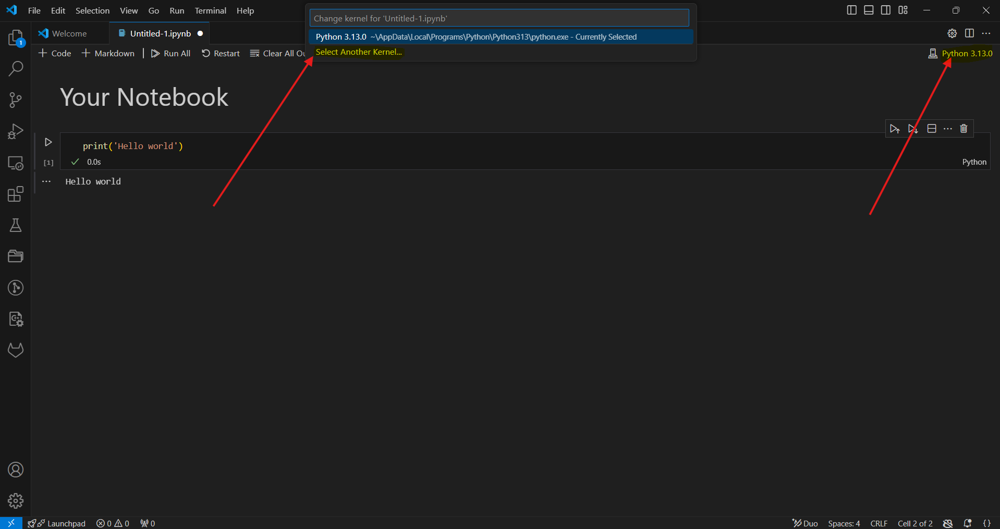

.. _quick_start.rst

===========
Quick Start 
===========

This section is designed to guide the user on how to install the package and use the Jupyter Notebooks. 
Once the user has git cloned the repository into their local machines, the user can comply the following steps:

Installation Guide
==================

1. Create a Virtual Environment
-------------------------------

Run the following command to create your virtual environment:

.. code-block:: bash

    python -m venv <your_env>

- If the above command fails, please try:

.. code-block:: bash

    python3 -m venv <your_env>

Replace ``<your_env>`` with your preferred environment name, e.g., ``dual_venv``.

2. Activate Your Virtual Environment
-------------------------------------

Activate your virtual environment with:

.. code-block:: bash

    source <your_env>/bin/activate

To deactivate your environment, use:

.. code-block:: bash

    deactivate

3. Install the Package
----------------------

You can install the ``dual_autodiff`` package in two ways (ensure your virtual environment is activated):

- Using `pip`:

  .. code-block:: bash

      pip install .

  Or, if you wish to install in editable mode (useful for development):

  .. code-block:: bash

      pip install -e .

  This will install both the pure Python and the Cythonized versions of the package.

- Using wheels:

  .. code-block:: bash

      pip install wheelhouse/dual_autodiff_x-0.1.0-cp312-cp312-manylinux_2_17_x86_64.manylinux2014_x86_64.whl

  Alternatively, navigate to the wheelhouse directory and run:

  .. code-block:: bash

      cd wheelhouse
      pip install dual_autodiff_x-0.1.0-cp312-cp312-manylinux_2_17_x86_64.manylinux2014_x86_64.whl

Using the Notebooks
===================

Once the user has successfully created a virtual environment and installed the package, 
to use the notebooks it is required to select the environment created in the kernel. 
Now the user should be able to run the Jupyter Notebooks 
(Visual Studio Code is recommended, You can install VS Code by visiting the official Visual Studio Code `website <https://code.visualstudio.com/>`_).

